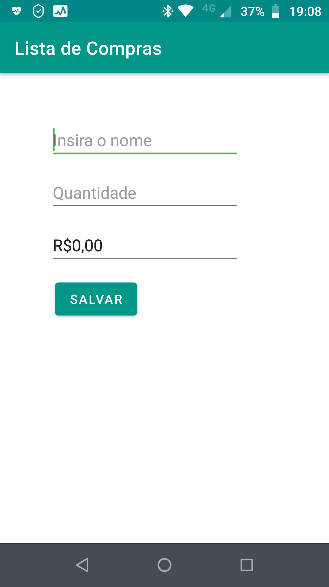
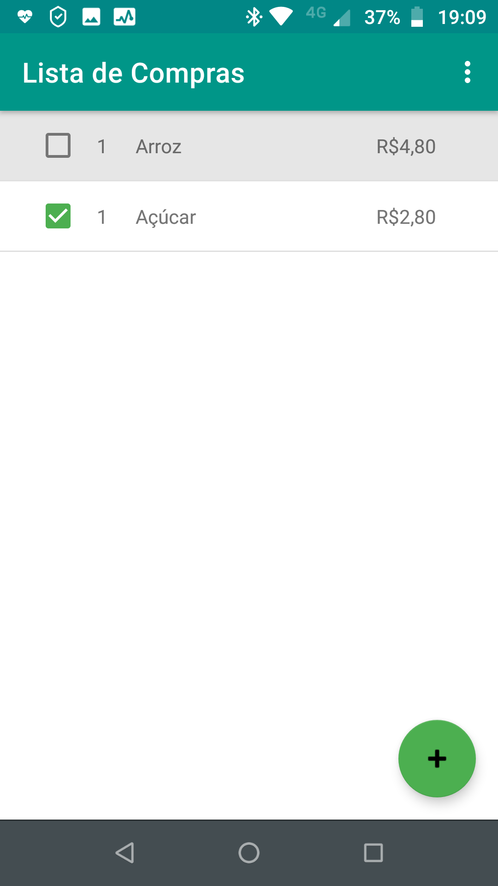
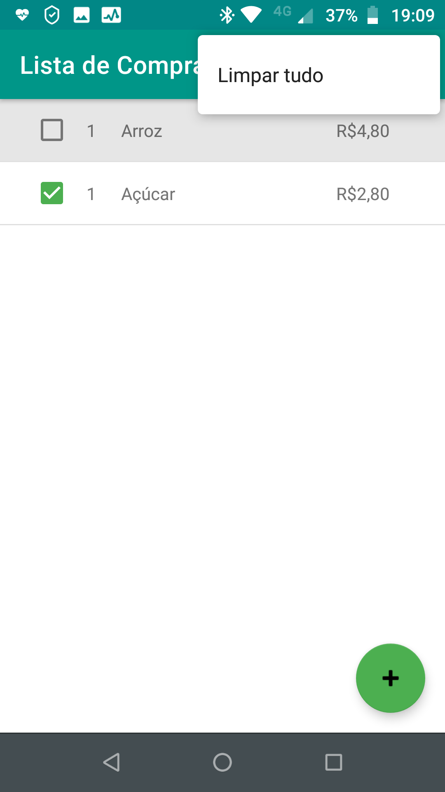

### Trabalho N1 - AIM0051 COMPUTACAO PARA DISPOSITIVOS MOVEIS

•  App Lista de Compras.  
•  Formulário com 3 campos.  
•  Suporte aos idiomas Inglês e Português.  
•  Utiliza o módulo CurrencyEditText para o campo preço. Créditos: https://github.com/BlacKCaT27/CurrencyEditText  

    
